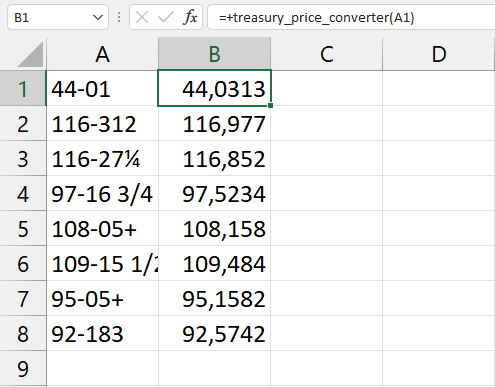

# Treasury Price Converter
Function to convert fractional treasury prices in decimal prices. For more details see: https://www.cmegroup.com/trading/interest-rates/files/treasury-futures-price-rounding-conventions-2020.pdf

The function can be used either in a python project or in an Excel file. The implementation in Excel is done through `xlwings`.

## How to run
  1. Clone the repository or download it as ZIP file
  2. Run ```pip install -r requirements.txt``` (optional)
  3. Use ```main.xlsm``` or import ```treasury_price_converter.bas``` in Excel

## Requirements
* `xlwings`

## Examples

<p align="center">
  
</p>
